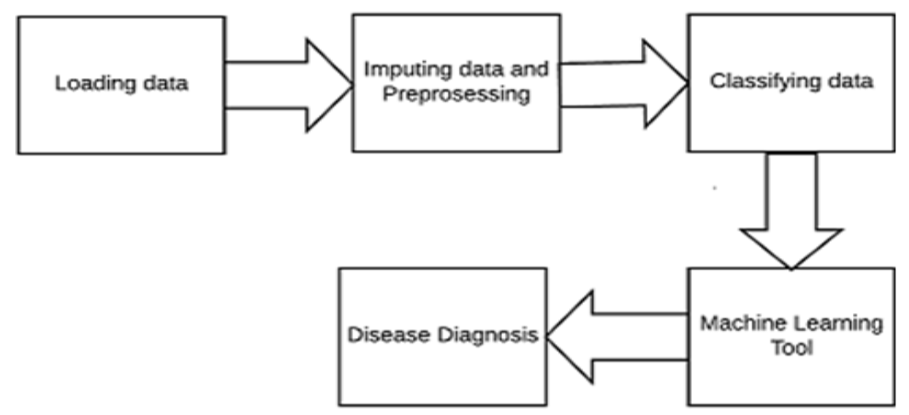
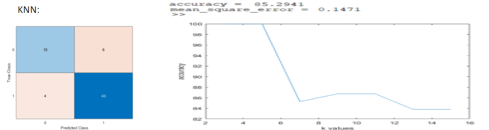
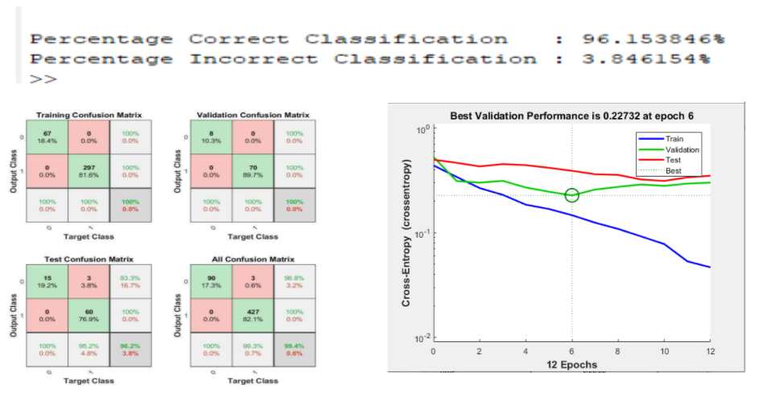

# Prediction Of Hepatitis Disease Using Machine Learning Technique 

    

## Contents
1.INTRODUCTION
2.ATTRIBUTES
3.BLOCK DIAGRAM
4.ALGORITHMS AND CLASSIFIERS 
5.RESULTS OBTAINED
6.CONCLUSION

## Introduction
- Medical diagnosis is an important and a quite complex task which requires accurate identification. 
- It is important to diagnose the disease at proper time and to be cured at the earliest. 
- Liver is the vital part of a human body.
- One of the severe diseases that affect the functionality of liver is Hepatitis, which causes inflammation of the liver.
- The main objective of this work is to perform a comparative study for a specific dataset by training the same dataset using different ML tool and neural network architecture, and choosing those best tool for diagnosis of Hepatitis disease. 

## ATTRIBUTES
| Attributes | Value | 
| :---: | :---:|
| Age | no(1), yes(2) |
| Numerical  value | no(1), yes(2) | 
| Sex | no(1), yes(2) | 
| male(1), female(2) | no(1), yes(2) | 
| Steroid | no(1), yes(2) v
| Liver Big | no(1), yes(2) | 
| Liver Firm | no(1), yes(2) | 
| Spiders | no(1), yes(2) | 
| Antivirals | no(1), yes(2)|  
| Fatigue | no(1), yes(2) | 
| Malaise | no(1), yes(2) | 
| Spleen Palpable | no(1), yes(2) | 
| Ascites | no(1), yes(2) | 
| Varices | no(1), yes(2) | 
| Varices | no(1), yes(2) | 
| Bilirubin | 0.39, 0.80, 1.20, 2.00, 3.00, 4.00 | 
| Alkaline Phosphate | 33, 80, 120, 160, 200, 250 | 
| Aspartate transaminase | 13, 100, 200, 300, 400, 500 | 
| Albumin | 2.1, 3.0, 3.8, 4.5, 5.0, 6.0 | 
| Pro-time | 10, 20, 30, 40, 50, 60, 70, 80, 90 | 
| Histology | no(1), yes(2) |

## Block Diagram

    

## Algorithms and Classifiers

### SVM(Support vector Machine)
- Support Vector Machine” (SVM) is a supervised machine learning algorithm which can be used for both classification or regression challenge.
- Support Vectors are simply the co-ordinates of individual observation.
- Support Vector Machine is a frontier which best segregates the two classes (hyper-plane/ line).
- Svm works by Identifying  the right hyper-plane.
- Hyper plane will decide the class of the new query image.
- Support vectors will help to locate the exact location of the hyper plane.

### KNN
- In pattern recognition ,the K – nearest neighbour is the non parametric algorithm used to classification and regression.
- KNN works by finding the distances between a query and all the examples in the data, selecting the specified number examples (K) closest to the query, then votes for the most frequent label (in the case of classification) or averages the labels (in the case of regression).

### ANN 
- Artificial neural networks (ANN) or connectionist systems are computing systems that are inspired by, but not identical to, biological neural networks that constitute animal brains.
- Artificial Neural Network(ANN) uses the processing of the brain as a basis to develop algorithms that can be used to model complex patterns and prediction problems.
- As you can see from the figure, an ANN is a very simplistic representation of a how a brain neuron works.

## Results

    
    
    

## Conclusion
- In this work, different machine learning techniques and neural networks were used for the diagnosis of Hepatitis. 
- A comparison on the accuracy for a particular data set was performed by using various ML and ANN techniques, for identifying the best tool for Hepatitis disease diagnosis. 
- We have used Support Vector Machine (SVM), Artificial Neural Network (ANN) and K Nearest Neighbor (KNN) to get the accurate prediction of the disease.
- With this study, it is inferred that out of all models considered and its performance, ANN is most accurate that gives a good prediction accuracy of 96 percentage and a minimum mean square error.
- As a future work the same will be implemented using RNN for the prediction of occurrence of other diseases.

## Paper link
[Prediction Of Hepatitis Disease Using Machine Learning Technique ](https://ieeexplore.ieee.org/abstract/document/9032585)

